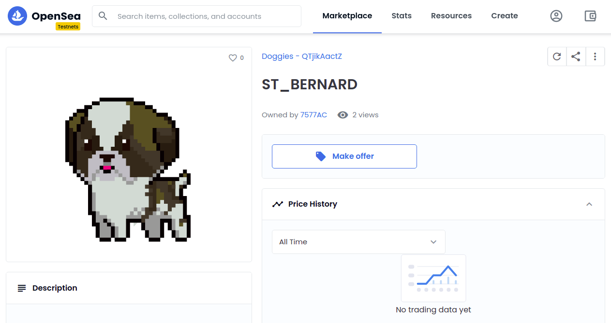

# NFT-721 Eth Standard
Smart contract project built in the Rinkeby Test Network for Ethereum. The contract consist on building an NFT token with the ERC-721 implementation for building non-fungible tokens on the ethereum virtual machine.



## Built With
- Solidity 0.6.6
- Python
- eth-brownie
- Rinkeby Test Network
- Metamask Wallet
- IPFS
- Infura

## Author

- 👤GitHub: [Jose Abel Ramirez](https://github.com/jose-Abel)
- Linkedin: [Jose Abel Ramirez Frontany](https://www.linkedin.com/in/jose-abel-ramirez-frontany-7674a842/)

## Getting Started

To download the project either can do it with with git clone command:

git clone 

Install the brownie library with:

```
    pip install eth-brownie
```

Create a free account at https://infura.io/


Create a new project at infura.io


Set up as an environment variable WEB3_INFURA_PROJECT_ID:

```
    export WEB3_INFURA_PROJECT_ID=<INFURA_PROJECT_ID>
```

To deploy the NFT Factory smart contract run:

```
    brownie run scripts/deploy_advanced.py --network rinkeby
```

To give more LINK funds to the NFT Factory smart contract to be able to create more than 1 collectible run:

```
    brownie run scripts/giving_more_funds.py --network rinkeby
```

To create an NFT collectible from the smart contract run:

```
    brownie run scripts/create_collectible.py --network rinkeby
```

To create the metadata to all the deployed collectibles run:

```
    brownie run scripts/create_metadata.py --network rinkeby
```

To set the token_uri to the collectibles so the metadata can be display on a platform such as OpenSea run:

```
    brownie run scripts/set_tokenuri.py --network rinkeby
```

## Live version

- Smart Contract on the rinkeby network

https://rinkeby.etherscan.io/address/0xf6c15a0e73c362f99c47e52baefc1131e09dcf9d

- NFT on OpenSea

https://testnets.opensea.io/assets/0xf6c15a0e73c362f99c47e52baefc1131e09dcf9d/0

https://testnets.opensea.io/assets/0xf6c15a0e73c362f99c47e52baefc1131e09dcf9d/1


## 📝 License

This project is MIT licensed.

## Show your support

Give a ⭐️ if you like this project!
